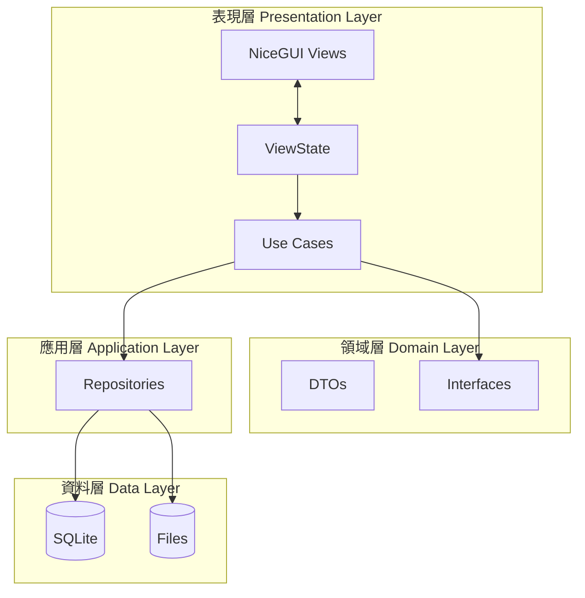

# 系統架構 (System Architecture)

## 概述

**Income Statement App** 採用 **分層式整潔架構 (Layered Clean Architecture)** 並結合 **NiceGUI** 作為表現層框架。此設計確保了關注點分離、可測試性以及易於維護。

## 關鍵參考

- [NiceGUI MVVM + Clean Architecture](nicegui-mvvm.md)
- 為避免全頁重整導致的閃爍，SPA 導航應使用 tab panels 或 dynamic content 替換。

## 分層設計 (Layers)

本應用程式分為以下層次：

### 1. 表現層 (Presentation Layer / UI)
*   **框架**: [NiceGUI](https://nicegui.io/)
*   **職責**: 渲染 UI 程式碼、處理使用者輸入、顯示狀態。
*   **模式**: **MVVM (ViewModel + ViewState + Effects)**。
    *   **Views**: 位於 `app/ui/pages` 與 `app/ui/components` 下的頁面與元件。
    *   **ViewModels**: 封裝每個頁面的意圖 (Intent) 與流程編排。
    *   **State**: 每個頁面/功能對應一個 ViewState；View 僅根據 State 進行渲染。
    *   **Effects**: 處理一次性的 UI 效果 (如 Toast、Dialog、導航)。

### 2. 領域層 (Domain Layer)
*   **職責**: 定義核心業務實體與資料結構。
*   **組件**:
    *   **DTOs (Data Transfer Objects)**: 用於層與層之間傳遞資料的純資料類別 (例如 `LawyerDTO`、`SeparateLedgerResultDTO`)。
    *   **Interfaces (Ports)**: 定義與外部依賴溝通的抽象介面 (例如 `UserInteractionProvider`, `LawyerRepository`)。

### 3. 應用層 (Application Layer)
*   **職責**: 編排業務邏輯與工作流程。
*   **組件**:
    *   **Use Cases**: 編排「匯入 Excel」、「明細分帳」、「自動填寫」與「匯出」等流程 (例如 `AutoFillUseCase`)。
    *   **Ports**: Use Cases 使用的 Repository 或 Gateway 介面。
*   **特性**: 應用層程式碼僅依賴 `domain` 與 `ports`。

### 4. 基礎設施層 (Infrastructure Layer)
*   **職責**: 外部系統的實作 (資料庫、檔案系統、視窗控制)。
*   **組件**:
    *   **Repositories**:
        *   `CodeReplacementRepository`: 管理代碼替換規則 (SQLite)。
        *   `LawyerRepository`: 管理律師資料 (SQLite)。
        *   `ExcelRepository`: 基於 `pandas` 與 `openpyxl` 的檔案封裝。
    *   **Gateways**:
        *   檔案選擇器 (Web/Native)。
    *   **Runtime**:
        *   背景任務執行器。

## 架構圖 (Diagram)

## 技術堆疊 (Technology Stack)

*   **語言**: Python 3.10+
*   **UI 框架**: NiceGUI (基於 Quasar/Vue)
*   **資料庫**: SQLite + SQLAlchemy
*   **資料處理**: Pandas, OpenPyXL
*   **打包發布**: PyInstaller (nicegui-pack)
