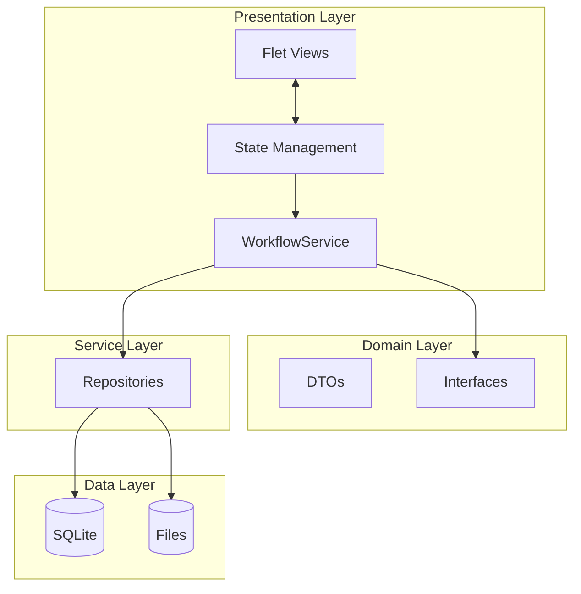

# System Architecture

## Overview

The **Income Statement App** adopts a **Layered Clean Architecture** combined with **Flet (Flutter for Python)** for the presentation layer. This design ensures separation of concerns, testability, and ease of maintenance.

## Layers

The application is divided into the following layers:

### 1. Presentation Layer (UI)
*   **Framework**: [Flet](https://flet.dev/)
*   **Responsibility**: Rendering UI code, handling user input, and displaying state.
*   **Pattern**: **MVVM-like (Model-View-ViewModel/State)**.
    *   **Views**: Stateless/Stateful functional components (e.g., `WorkflowView`, `DatabaseView`). Inherit from `ft.Column` or `ft.UserControl` (Legacy).
    *   **State**: Classes holding the reactive state (e.g., `WorkflowState`, `DatabaseState`). Changes in State trigger UI updates.
    *   **Interaction**: `FletInteractionProvider` manages UI dialogs (alerts, confirmations) safely across threads.

### 2. Domain Layer
*   **Responsibility**: Defining core business entities and data structures.
*   **Components**:
    *   **DTOs (Data Transfer Objects)**: Pure data classes used to pass data between layers (e.g., `LawyerDTO`, `AliasDTO`, `SeparateLedgerResultDTO`).
    *   **Interfaces**: Abstract protocols defining contracts for dependencies (e.g., `UserInteractionProvider`).

### 3. Service Layer
*   **Responsibility**: Orchestrating business logic and workflows.
*   **Components**:
    *   `WorkflowService`: Manages complex processes like "Separate Ledger" and "Auto Fill".
    *   `ExcelReportService`: Handles the generation and formatting of final Excel reports.
*   **Characteristics**: Services are UI-agnostic. They interact with the UI only via abstracted interfaces (`UserInteractionProvider`).

### 4. Data Layer
*   **Responsibility**: Abstraction of data sources (Database, Files).
*   **Components**:
    *   **Repositories**:
        *   `AliasRepository`: CRUD for Alias data (SQLite).
        *   `LawyerRepository`: CRUD for Lawyer data (SQLite).
        *   `ExcelRepository`: Low-level wrapper for `pandas` and `openpyxl` file I/O.
    *   **Infrastructure**:
        *   **SQLAlchemy**: ORM for SQLite database interactions.
        *   **OpenPyXL / Pandas**: Engines for parsing and writing Excel files.

## Diagram

## Technology Stack

*   **Language**: Python 3.13+
*   **UI**: Flet
*   **Database**: SQLite + SQLAlchemy
*   **Data Processing**: Pandas, OpenPyXL
*   **Distribution**: Briefcase
