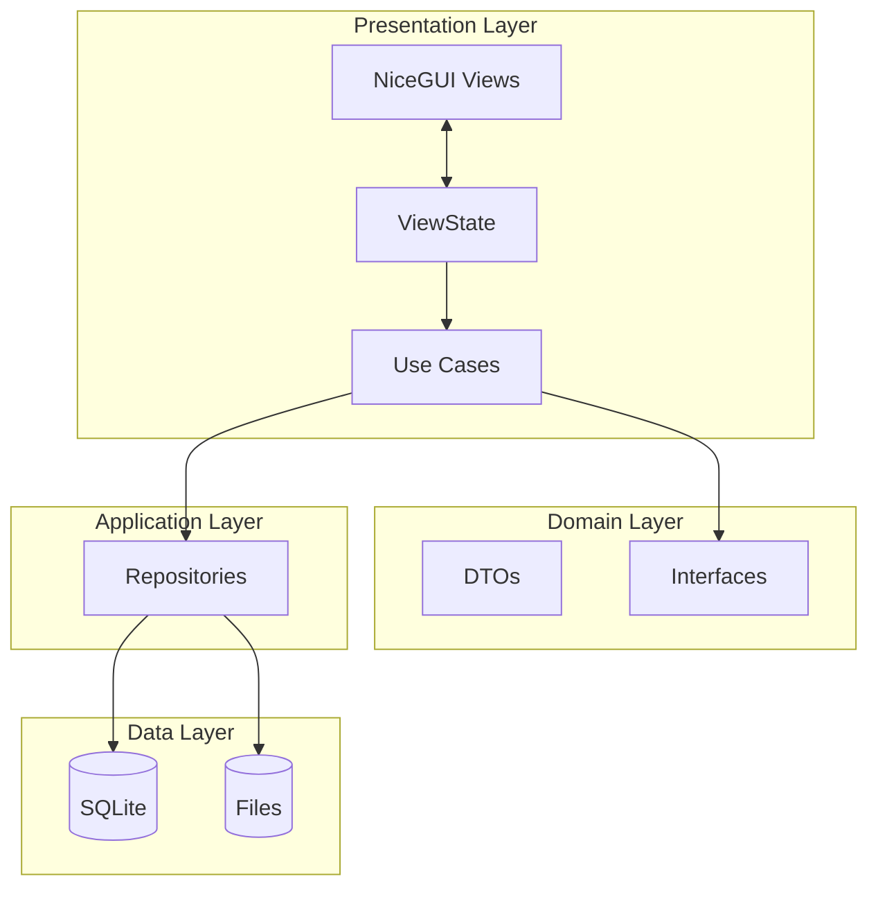

# System Architecture

## Overview

The **Income Statement App** adopts a **Layered Clean Architecture** combined with **NiceGUI** for the presentation layer. This design ensures separation of concerns, testability, and ease of maintenance.

## Key References

- [NiceGUI MVVM + Clean Architecture](nicegui-mvvm.md)
- For SPA navigation without full page rebuilds, use `ui.sub_pages` to avoid flicker.

## Layers

The application is divided into the following layers:

### 1. Presentation Layer (UI)
*   **Framework**: [NiceGUI](https://nicegui.io/)
*   **Responsibility**: Rendering UI code, handling user input, and displaying state.
*   **Pattern**: **MVVM (ViewModel + ViewState + Effects)**.
    *   **Views**: Pages/components under `app/ui/pages` and `app/ui/components`.
    *   **ViewModels**: Encapsulate intents and workflow orchestration per page.
    *   **State**: One ViewState per page/feature; view re-renders from state only.
    *   **Effects**: One-time UI effects (toast/dialog/navigation).

### 2. Domain Layer
*   **Responsibility**: Defining core business entities and data structures.
*   **Components**:
    *   **DTOs (Data Transfer Objects)**: Pure data classes used to pass data between layers (e.g., `LawyerDTO`, `AliasDTO`, `SeparateLedgerResultDTO`).
    *   **Interfaces**: Abstract protocols defining contracts for dependencies (e.g., `UserInteractionProvider`).

### 3. Application Layer
*   **Responsibility**: Orchestrating business logic and workflows.
*   **Components**:
    *   **Use Cases**: Orchestrate "Import Excel", "Separate Ledger", "Auto Fill", and "Export".
    *   **Ports**: Interfaces for repositories/gateways used by Use Cases.
*   **Characteristics**: Application code depends on `domain` and ports only.

### 4. Infrastructure Layer
*   **Responsibility**: Abstraction of external systems (Database, Files, OS dialogs).
*   **Components**:
    *   **Repositories**:
        *   `AliasRepository`: CRUD for Alias data (SQLite).
        *   `LawyerRepository`: CRUD for Lawyer data (SQLite).
        *   `ExcelRepository`: Low-level wrapper for `pandas` and `openpyxl` file I/O.
    *   **Gateways**:
        *   File picker for web/native environments.
    *   **Runtime**:
        *   Task runners for background jobs.

## Diagram

## Technology Stack

*   **Language**: Python 3.13+
*   **UI**: NiceGUI
*   **Database**: SQLite + SQLAlchemy
*   **Data Processing**: Pandas, OpenPyXL
*   **Distribution**: Briefcase
